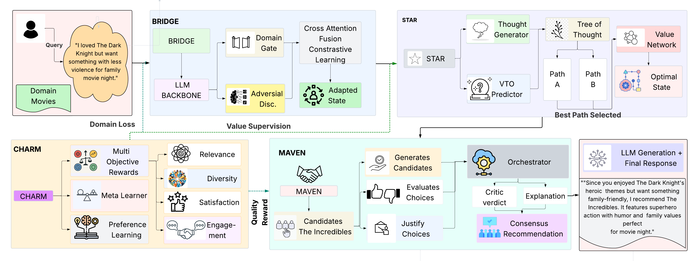

<div align="center">
  <h1>HARPO: Hierarchical Agentic Reasoning for User-Aligned Conversational Recommendation</h1>

  <p>
    <a href="https://github.com/harpo-bench/harpo" target="_blank">
      
    </a>
    <a href="https://arxiv.org/abs/XXXX.XXXXX" target="_blank">
      
    </a>
    <!-- <a href="https://aclanthology.org/" target="_blank">
      
    </a> -->
  </p>

  <p><em>by</em></p>

  <table>
    <tr>
      <td align="center" style="padding: 0 16px;">
        <strong>Subham Raj</strong><br/>
        IIT Patna
      </td>
      <td align="center" style="padding: 0 16px;">
        <strong>Aman Vaibhav Jha</strong><br/>
        IIT Patna
      </td>
      <td align="center" style="padding: 0 16px;">
        <strong>Mayank Anand</strong><br/>
        IIIT Allahabad
      </td>
      <td align="center" style="padding: 0 16px;">
        <strong>Sriparna Saha</strong><br/>
        IIT Patna
      </td>
    </tr>
  </table>

</div>

<br/>

This repository contains the official implementation of **HARPO** (*Hierarchical Agentic Reasoning with Preference Optimization*), an agentic framework for conversational recommender systems that explicitly optimizes for user-aligned recommendation quality. Accepted at **ACL 2026 (Main)**.

---

## Overview

Conversational recommender systems are typically trained and evaluated using proxy metrics (e.g., Recall@K, BLEU) that weakly reflect actual user-aligned recommendation quality. **HARPO** reframes conversational recommendation as a structured decision-making problem, combining deliberative reasoning with hierarchical preference optimization to treat recommendation quality as a first-class objective.

HARPO integrates four components:

- **CHARM** (*Contrastive Hierarchical Alignment with Reward Marginalization*): Decomposes recommendation quality into four interpretable dimensions — relevance, diversity, predicted user satisfaction, and engagement — and learns context-dependent weights over these dimensions via meta-learning.
- **STAR** (*Structured Tree-of-Thought Agentic Reasoning*): Quality-aware tree search guided by a learned value network that evaluates candidate reasoning paths based on predicted recommendation quality rather than task completion.
- **BRIDGE** (*Bidirectional Reasoning-Informed Domain-Generalized Embeddings*): Cross-domain transfer via adversarial domain adaptation combined with learnable domain gates, enabling transferable recommendation reasoning across domains.
- **MAVEN** (*Multi-Agent Virtual Environment for Recommendations*): Multi-agent refinement through collaborative critique among specialized Recommender, Critic, and Explainer agents.

<p align="center">
  
  <br/>
  <em><strong>Figure 1.</strong> Overall architecture of HARPO. STAR handles structured agentic reasoning, CHARM drives hierarchical preference optimization, BRIDGE enables cross-domain transfer, and MAVEN performs multi-agent refinement — all built on a shared DeepSeek-R1-Distill-Qwen-7B backbone.</em>
</p>

For full technical details, see the paper.

---

## Results

### Main Results (Table 3)

| Method | R@1 | R@10 | R@50 | MRR@10 | NDCG@10 | User Sat. | Engage. |
|--------|-----|------|------|--------|---------|-----------|---------|
| **ReDial** | | | | | | | |
| UniCRS | 4.8±0.3 | 21.2±0.5 | 40.8±0.8 | 10.1±0.3 | 13.8±0.4 | 0.51±0.02 | 0.47±0.02 |
| DCRS | 7.5±0.3 | 25.1±0.6 | 43.6±0.9 | 12.2±0.4 | 15.2±0.5 | 0.56±0.02 | 0.52±0.02 |
| GPT-4 | 4.5±0.4 | 19.4±0.8 | 40.2±1.2 | 9.6±0.5 | 13.2±0.6 | 0.55±0.03 | 0.51±0.03 |
| RecMind | 5.8±0.3 | 22.6±0.6 | 42.2±0.9 | 11.2±0.4 | 15.3±0.5 | 0.54±0.02 | 0.50±0.02 |
| **HARPO** | **9.1±0.3** | **29.8±0.7** | **50.2±1.0** | **15.6±0.5** | **21.2±0.6** | **0.68±0.02** | **0.64±0.02** |
| **INSPIRED** | | | | | | | |
| GPT-4 | 4.2±0.5 | 18.8±0.9 | 39.4±1.5 | 9.4±0.5 | 12.9±0.6 | 0.53±0.03 | 0.49±0.03 |
| RecMind | 4.8±0.4 | 20.4±0.8 | 41.2±1.3 | 10.2±0.5 | 14.0±0.6 | 0.52±0.03 | 0.48±0.03 |
| **HARPO** | **7.2±0.4** | **27.4±0.9** | **48.8±1.4** | **14.2±0.6** | **19.4±0.7** | **0.66±0.03** | **0.62±0.03** |
| **MUSE (Multimodal Fashion)** | | | | | | | |
| Qwen2-VL-7B | 8.4±0.4 | 34.2±0.8 | 52.8±1.3 | 17.2±0.4 | 23.1±0.5 | 0.61±0.03 | 0.57±0.03 |
| GPT-4V | 4.4±0.5 | 23.2±0.9 | 42.6±1.4 | 10.8±0.5 | 14.8±0.6 | 0.54±0.03 | 0.50±0.03 |
| **HARPO** | **10.2±0.4** | **38.6±0.9** | **58.4±1.3** | **19.8±0.5** | **26.4±0.6** | **0.72±0.03** | **0.68±0.03** |

All HARPO improvements are statistically significant at p < 0.01 (paired t-test with Bonferroni correction).

### Ablation Study on ReDial (Table 4)

| Variant | R@10 | MRR@10 | NDCG@10 | Sat. | Eng. |
|---------|------|--------|---------|------|------|
| HARPO (Full) | 29.8 | 15.6 | 21.2 | 0.68 | 0.64 |
| w/o CHARM | 24.6 | 12.6 | 17.2 | 0.55 | 0.51 |
| w/o STAR | 27.0 | 14.0 | 19.0 | 0.63 | 0.59 |
| w/o BRIDGE | 28.4 | 14.9 | 20.2 | 0.66 | 0.62 |
| w/o MAVEN | 28.0 | 14.7 | 19.9 | 0.65 | 0.61 |
| w/o VTOs | 23.4 | 12.0 | 16.4 | 0.53 | 0.49 |
| SFT Only | 21.6 | 10.6 | 14.6 | 0.50 | 0.46 |

### Human Evaluation on ReDial (Table 8)

| Method | Rec. Quality | Exp. Quality | Overall | κ |
|--------|--------------|--------------|---------|---|
| UniCRS | 3.18±0.12 | 2.86±0.14 | 3.04±0.11 | 0.73 |
| GPT-4 | 3.48±0.11 | 3.42±0.13 | 3.46±0.10 | 0.74 |
| **HARPO** | **4.08±0.10** | **3.92±0.12** | **4.01±0.09** | 0.78 |

Scores on 1–5 scale. κ = Fleiss' kappa. 200 samples rated by 3 annotators.

---

## Repository Structure

```
harpo/
├── README.md
├── requirements.txt
├── setup.py
├── src/
│   ├── __init__.py
│   ├── config.py
│   ├── model.py
│   ├── training.py
│   ├── evaluation.py
│   └── data_generation.py
├── scripts/
│   ├── convert_redial.py
│   ├── convert_inspired.py
│   ├── train.py
│   ├── evaluate.py
│   └── chat.py
├── configs/
│   ├── accelerate_config.yaml
│   └── training_config.yaml
├── data/
│   └── (see Data Preparation)
└── tests/
    └── test_model.py
```

---

## Installation

```bash
git clone https://anonymous.4open.science/r/HARPO-D881
cd harpo

conda create -n harpo python=3.10
conda activate harpo

pip install -r requirements.txt

# Optional: Flash Attention 2 (requires CUDA)
pip install flash-attn --no-build-isolation
```

---

## Data Preparation

Download and process datasets:

```bash
# ReDial
python scripts/convert_redial.py --output data/redial

# INSPIRED
python scripts/convert_inspired.py --output data/inspired
```

---

## Training

### Model & Configuration

- **Backbone**: `DeepSeek-R1-Distill-Qwen-7B`
- **LoRA**: rank 16, alpha 32 (applied to all attention + MLP projections)
- **Trainable parameters**: 42.7M (0.6% of base model)

### Training Hyperparameters

| Stage | Learning Rate | Epochs |
|-------|---------------|--------|
| SFT | 5e-5 | 3 |
| CHARM | 2e-5 | 2 |
| STAR | 1e-5 | 2 |
| MAVEN | 2e-6 | 1 |

- Batch size: 4 per GPU · 4 gradient accumulation · 2 GPUs = effective batch 32
- Max sequence length: 512 tokens

### Single GPU

```bash
python scripts/train.py \
    --sft data/redial/sft_data.json \
    --pref data/redial/preference_data.json \
    --output outputs/redial
```

### Multi-GPU (Recommended)

```bash
accelerate launch --config_file configs/accelerate_config.yaml \
    scripts/train.py \
    --sft data/redial/sft_data.json \
    --pref data/redial/preference_data.json \
    --output outputs/redial
```

Ensure `--num_processes` matches the number of GPUs requested (e.g., 2 GPUs → `--num_processes 2`).

---

## Evaluation

```bash
python scripts/evaluate.py \
    --checkpoint outputs/redial/checkpoints/final \
    --test-data data/redial/test.json \
    --output results/redial
```

---

## Component Configuration

### STAR

- Beam width: 3 · Max depth: 3 · Backtrack threshold: 0.3

### CHARM

- Reward dimensions: 4 (relevance, diversity, satisfaction, engagement)
- β (preference strength): 0.5

### MAVEN

- 3 agents: Recommender, Critic, Explainer
- 2 communication rounds

---

## Computational Requirements

Training on 2× NVIDIA A100 80GB:

| Stage | Time | Memory |
|-------|------|--------|
| SFT | 52 min | 68 GB |
| CHARM | 42 min | 62 GB |
| STAR | 46 min | 58 GB |
| MAVEN | 36 min | 56 GB |
| **Total** | **~2.9 hours** | 68 GB |

Inference latency per turn: Full HARPO 298 ms · Without STAR 88 ms.

---

## Virtual Tool Operations (VTOs)

HARPO uses 21 domain-agnostic VTOs organized into 7 categories:

| Category | Operations |
|----------|------------|
| Extraction | `analyze_sentiment`, `extract_context`, `extract_entities` |
| User Modeling | `retrieve_preferences`, `identify_constraints`, `model_user_state` |
| Retrieval | `search_candidates`, `filter_results`, `match_attributes` |
| Ranking | `rank_options`, `compare_options`, `select_best` |
| Reasoning | `query_knowledge`, `reason_over_graph`, `infer_implicit` |
| Interaction | `explain_choice`, `refine_query`, `handle_rejection` |
| Memory | `track_history`, `update_beliefs`, `recall_context` |

---

## Core APIs

### Quick Start

```python
from harpo import Evaluator

evaluator = Evaluator(model_path="model.pt")
scores = evaluator.score(context, response)
print(f"Satisfaction: {scores.satisfaction:.3f}")
```

### Python API

```python
from harpo import Evaluator, Comparator, Explainer

# Score a single response
evaluator = Evaluator(model_path="path/to/model")
scores = evaluator.score(
    context="What movies do you recommend?",
    response="I recommend Inception..."
)

# Batch score
results = evaluator.batch_score(contexts, responses)

# Compare two responses
comparator = Comparator(model_path="path/to/model")
comparison = comparator.compare(context, response_a, response_b)

# Explain a score
explainer = Explainer(model_path="path/to/model")
explanation = explainer.explain(context, response)
```

### REST API

```bash
python -m uvicorn src.api_server:app --host 0.0.0.0 --port 8000
```

Endpoints: `POST /evaluate` · `POST /batch-evaluate` · `POST /compare` · `POST /explain` · `GET /health`

### Command Line

```bash
harpo evaluate outputs.json --metrics all --output results.json
harpo compare predictions_a.json predictions_b.json
harpo explain context.txt response.txt --output explanation.json
```

---

## Citation

```bibtex
@inproceedings{raj2025harpo,
  title     = {HARPO: Hierarchical Agentic Reasoning for User-Aligned Conversational Recommendation},
  author    = {Raj, Subham and Jha, Aman Vaibhav and Anand, Mayank and Saha, Sriparna},
  booktitle = {Proceedings of the 63rd Annual Meeting of the Association for Computational Linguistics},
  year      = {2025}
}
```

---

## License

MIT License

## Acknowledgments

- DeepSeek for the R1-Distill-Qwen-7B model
- ReDial, INSPIRED, and MUSE dataset creators
- HuggingFace Transformers library
